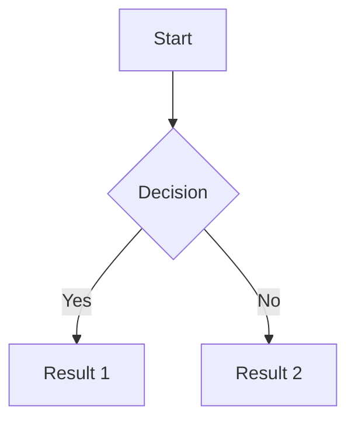

# Twilight 博客使用手册

> 适用于 Twilight v1.x | 基于 Astro + Svelte | 部署于 GitHub Pages

---

## 目录

1. [项目结构](#1-项目结构)
2. [站点配置](#2-站点配置)
3. [内容管理](#3-内容管理)
   - 3.1 [文章 Posts](#31-文章-posts)
   - 3.2 [页面 Pages](#32-页面-pages)
   - 3.3 [作品集 Projects](#33-作品集-projects)
   - 3.4 [技能展示 Skills](#34-技能展示-skills)
   - 3.5 [时间线 Timeline](#35-时间线-timeline)
   - 3.6 [相册 Albums](#36-相册-albums)
   - 3.7 [日记 Diary](#37-日记-diary)
   - 3.8 [友情链接 Friends](#38-友情链接-friends)
4. [写作指南](#4-写作指南)
5. [部署](#5-部署)
6. [常见问题](#6-常见问题)

---

## 1. 项目结构

```
Twilight-blog/
├── public/                      # 静态资源（构建时原样复制到 dist）
│   └── assets/                  # 用户上传的资源
│       ├── images/              # 图片（头像、封面、壁纸等）
│       ├── css/
│       └── js/
├── src/
│   ├── components/              # Svelte 组件
│   │   ├── navbar/             # 导航栏组件
│   │   ├── sidebar/            # 侧边栏组件
│   │   └── ...
│   ├── content/                # CMS 内容目录 ⭐
│   │   ├── posts/              # 文章（Markdown）
│   │   │   └── guide/          # 子分类示例
│   │   ├── projects/           # 作品集（JSON）
│   │   ├── skills/             # 技能展示（JSON）
│   │   ├── timeline/           # 时间线（JSON）
│   │   ├── albums/             # 相册（JSON + 图片）
│   │   ├── diary/              # 日记（JSON + 图片）
│   │   ├── friends.md          # 友链页面
│   │   ├── friends/            # 友链数据（JSON）
│   │   └── about.md             # 关于页面
│   ├── i18n/
│   │   └── languages/
│   │       ├── zh.ts           # 中文翻译
│   │       └── en.ts           # 英文翻译
│   ├── layouts/                # Astro 布局组件
│   ├── pages/                  # Astro 页面路由
│   ├── styles/                 # 全局样式
│   ├── content.config.ts       # 内容集合定义
│   └── utils/                  # 工具函数
├── dist/                       # 构建输出目录（推送到 GitHub Pages）
├── twilight.config.yaml        # 主题配置文件 ⭐
├── astro.config.mjs            # Astro 构建配置
└── package.json
```

**关键说明：**

- `src/content/` 下所有以 `_` 开头的文件或文件夹会被忽略（如 `_drafts/`）
- `public/assets/` 中的资源通过 `/assets/...` 路径引用
- `twilight.config.yaml` 是核心配置文件，无需修改代码即可配置大部分功能
- 部署时只推送 `dist/` 目录内容到 GitHub Pages

---

## 2. 站点配置

所有站点配置集中在 `twilight.config.yaml` 文件中。

### 2.1 基础信息

```yaml
site:
    siteURL: "https://auraduan.github.io/"   # 站点地址（末尾斜杠）
    title: "SD_1631的博客"                      # 浏览器标签和首页标题
    subtitle: "技术博客 | 低空飞行器 | PX4飞控"   # 副标题
    lang: "zh"                                 # 默认语言
```

### 2.2 主题色

```yaml
site:
    themeColor:
        hue: 200    # 色相值 0-360，推荐：青色 200、蓝色 210、紫色 270
```

> 修改后需重新 `pnpm build`。

### 2.3 深色/浅色模式

```yaml
site:
    defaultTheme: "dark"    # "dark" | "light" | "auto"（跟随系统）
```

### 2.4 导航栏

```yaml
navbar:
    links:
        - "Home"                          # 简单链接，使用 i18n 翻译
        - "Archive"                       # 归档页
        - name: "Exhibition"              # 带下拉菜单的分组
          url: "/exhibition/"
          icon: "material-symbols:person"
          description: "我的作品与经历"
          children:
              - "Projects"
              - "Skills"
              - "Timeline"
        - "Friends"                       # 友情链接页
        - "About"                         # 关于页
```

### 2.5 个人资料卡

```yaml
profile:
    avatar: "/assets/images/avatar.jpg"   # 头像（建议 1:1 比例）
    name: "auraduan"                       # 显示名称
    bio: "低空飞行器开发者 | PX4飞控爱好者" # 个人简介
    links:
        - name: "GitHub"
          icon: "fa6-brands:github"
          url: "https://github.com/auraduan"
```

> 图标使用 Material Symbols 或 FontAwesome 6 图标名称。

### 2.6 公告栏

```yaml
announcement:
    title: "公告"
    content: "欢迎来到我的技术博客！"
    closable: true
    link:
        enable: true
        text: "了解更多"
        url: "/about/"
```

### 2.7 文章设置

```yaml
post:
    showLastModified: true        # 显示最后修改时间
    expressiveCode:
        theme: "github-dark"     # 代码高亮主题
    license:
        enable: true
        name: "CC BY-NC-SA 4.0"
        url: "https://creativecommons.org/licenses/by-nc-sa/4.0/"
    comment:
        enable: false             # 全局评论开关
        twikoo:
            envId: ""             # Twikoo 环境 ID
            lang: "zh"
```

### 2.8 粒子特效

```yaml
particle:
    enable: true                  # 开启粒子漂浮特效
    particleNum: 12               # 粒子数量
```

### 2.9 音乐播放器（MetingJS）

```yaml
musicPlayer:
    enable: true
    mode: "meting"               # 使用 MetingJS（推荐）
    meting:
        meting_api: "https://meting.spr-aachen.com/api"
        server: "netease"        # netease | tencent | youtube | etc.
        type: "playlist"          # playlist | song | album | artist
        id: "你的网易云歌单ID"      # 歌单 ID（网易云 URL 中 /playlist/?id= 后面的数字）
    autoplay: false              # 自动播放
```

### 2.10 看板娘（Live2d）

```yaml
pio:
    enable: true                  # 开启看板娘
    models:
        - "/pio/models/pio/model.json"
    position: "left"              # left | right
    width: 280
    height: 250
    mode: "draggable"             # draggable | static
    hiddenOnMobile: true
```

> 看板娘模型需要额外配置，将 Live2d 模型文件放入 `public/pio/models/`。

### 2.11 壁纸配置

```yaml
wallpaper:
    mode: "banner"               # banner（全屏横幅）
    src:
        desktop:
            - "/assets/images/desktopWallpaper_1.jpg"
        mobile:
            - "/assets/images/mobileWallpaper_1.jpg"
    banner:
        homeText:
            enable: true
            title: "SD_1631"
            typewriter:
                enable: true
                speed: 111
                deleteSpeed: 51
                pauseTime: 3000
                subtitle:
                    - "低空飞行器开发"
                    - "PX4飞控学习"
                    - "技术笔记"
```

### 2.12 其他配置

| 配置项 | 说明 |
|--------|------|
| `site.timeZone` | 时区，数字，如 `8` 表示东八区 |
| `sidebar` | 侧边栏组件配置 |
| `footer` | 页脚自定义 HTML |
| `analytics` | 统计服务（支持 Umami） |
| `loadingOverlay` | 加载遮罩动画 |
| `translate` | 页面翻译（Google 翻译） |

---

## 3. 内容管理

所有内容都在 `src/content/` 目录下，以文件（Markdown/JSON）或文件夹形式组织。

### 3.1 文章 Posts

文章是最核心的内容类型，使用 Markdown 编写。

**存放位置：** `src/content/posts/*.md`

**Frontmatter 完整参数：**

```yaml
---
title: 文章标题
published: 2026-05-09              # 发布日期（必填）
updated: 2026-05-10               # 最后修改日期（可选）
description: "文章描述/摘要"       # SEO 摘要和卡片显示
cover: "/assets/images/cover.jpg" # 封面图（可选）
coverInContent: false             # 封面图是否插入到文章内容顶部
category: 博客                     # 分类（支持嵌套如 "编程/前端"）
tags: [博客, 技术, Astro]          # 标签（数组）
lang: "zh"                         # 文章语言
pinned: false                      # 是否置顶
author: "auraduan"                 # 作者
sourceLink: ""                     # 原文链接
licenseName: "CC BY-NC-SA 4.0"     # 文章许可协议
licenseUrl: "https://..."
comment: true                      # 是否开启评论
draft: false                       # 是否为草稿（草稿不会发布）
encrypted: false                  # 是否加密
password: "123456"                # 解密密码

# 自定义路由（可选）
# routeName: "custom-slug"        # 将 URL 从 /posts/xxx 改为 /custom-slug

# 以下字段由系统自动填充，无需手动设置
prevTitle: ""
prevSlug: ""
nextTitle: ""
nextSlug: ""
---
```

**分类嵌套写法：**

```yaml
category: "编程/前端/Astro"   # 生成多级分类路径
```

**文章加密示例：**

```yaml
---
title: 私密文章
published: 2026-05-09
encrypted: true
password: "mypassword"
---
```

**目录结构示例：**

```
src/content/posts/
├── blog-launched.md            # 根级文章 → /posts/blog-launched
├── encryption.md               # → /posts/encryption
└── guide/
    └── getting-started.md      # 子目录 → /posts/guide/getting-started
```

> ⚠️ 目录下不能放 `_` 开头的文件（会被忽略）。

---

### 3.2 页面 Pages

页面是独立内容，使用 Markdown 编写。

**关于页：** `src/content/about.md`

```markdown
---
title: 关于
---

# 关于我

这里是关于页的内容。支持完整的 Markdown 语法。

## 支持的组件

::github{repo="Spr-Aachen/Twilight"}
::bilibili{uid="..."}

## Milestones

- 2025-01: 开始使用 Twilight
```

> 目前 `src/content/about.md` 由主题内置组件自动渲染自定义内容，编辑该文件的效果可能有限。

---

### 3.3 作品集 Projects

**存放位置：** `src/content/projects/*.json`

**JSON 结构：**

```json
{
    "name": "项目名称",
    "description": "项目简短描述",
    "icon": "material-symbols:code",     // 图标（可选）
    "category": "frontend",               // 分类
    "level": "beginner",                  // beginner | intermediate | advanced
    "experience": {
        "years": 1,
        "months": 3                       // 经验时长
    },
    "projects": ["相关项目名"],            // 相关项目（可选）
    "color": "#7C3AED",                   // 主题色（可选）
    "featured": true                      // 是否在首页特别展示
}
```

**项目时间线条目（Timeline）JSON：**

```json
{
    "title": "Twilight",
    "description": "基于 Astro 的博客模板项目",
    "type": "project",                   // project | work | education
    "startDate": "2025-10-01",
    "endDate": "",
    "skills": ["Astro", "Svelte", "Tailwind CSS"],
    "achievements": [],
    "links": [
        {
            "name": "在线演示",
            "url": "https://twilight.spr-aachen.com",
            "type": "project"
        },
        {
            "name": "GitHub 仓库",
            "url": "https://github.com/Spr-Aachen/Twilight",
            "type": "project"
        }
    ],
    "icon": "material-symbols:code",
    "color": "#7C3AED",
    "featured": true
}
```

**Timeline `type` 类型：**

| type | 说明 |
|------|------|
| `project` | 项目经历 |
| `work` | 工作经历 |
| `education` | 教育经历 |

---

### 3.4 技能展示 Skills

**存放位置：** `src/content/skills/*.json`

```json
{
    "title": "Astro",
    "imgurl": "https://avatars.githubusercontent.com/...",
    "desc": "现代化静态网站生成框架",
    "siteurl": "https://github.com/withastro/astro",
    "tags": ["Framework"]
}
```

| 字段 | 必填 | 说明 |
|------|------|------|
| `title` | ✅ | 技能名称 |
| `imgurl` | ✅ | 技能图标/Logo URL |
| `desc` | ✅ | 技能描述 |
| `siteurl` | ❌ | 官方链接 |
| `tags` | ❌ | 标签数组 |

---

### 3.5 时间线 Timeline

**存放位置：** `src/content/timeline/*.json`

> 参见上方 3.3 项目 JSON，Timeline 使用相同的 JSON 结构。

**JSON 字段说明：**

| 字段 | 类型 | 说明 |
|------|------|------|
| `title` | string | 事件标题 |
| `description` | string | 事件描述 |
| `type` | string | `project` \| `work` \| `education` |
| `startDate` | string | 开始日期 `YYYY-MM-DD` |
| `endDate` | string | 结束日期（空字符串表示至今） |
| `skills` | string[] | 相关技能列表 |
| `achievements` | string[] | 成就/成果 |
| `links` | object[] | 相关链接 |
| `icon` | string | 图标名 |
| `color` | string | 主题色（十六进制） |
| `featured` | boolean | 是否精选 |

---

### 3.6 相册 Albums

**存放位置：** `src/content/albums/相册名/`

每个相册需要两个部分：
1. `jsonExample.json` — 相册配置和数据
2. 图片文件 — 放在同一目录下

**JSON 结构：**

```json
{
    "title": "相册标题",
    "description": "相册描述",
    "cover": "https://picsum.photos/800/600?random=1",
    "date": "2025-01-01T00:00:00.000Z",
    "location": "地点",
    "tags": ["example"],
    "layout": "masonry",        // masonry（瀑布流）| grid（网格）
    "columns": 3,               // 网格列数
    "photos": [
        {
            "src": "./智子_ASK.jpg",                         // 本地图片（相对路径）
            "src": "https://picsum.photos/800/600?random=2", // 或外部 URL
            "alt": "图片描述",
            "title": "图片标题",
            "description": "图片详细描述",
            "tags": ["tag1"]
        }
    ],
    "visible": true             // 是否公开显示
}
```

**目录结构：**

```
src/content/albums/
└── my-album/
    ├── jsonExample.json        # 相册配置文件
    ├── photo1.jpg              # 图片文件
    ├── photo2.jpg
    └── photo3.png
```

> 多个相册会生成 `/albums/` 下的多个相册页面。

---

### 3.7 日记 Diary

**存放位置：** `src/content/diary/年份/年份-月份.md`

例如：`src/content/diary/2025/2025-05.md`

**JSON 结构（条目级别）：**

```json
{
    "title": "日记标题",
    "content": "日记正文内容",
    "date": "2025-05-09T00:00:00Z",
    "images": [
        "./photo1.jpg",
        "https://picsum.photos/800/600?random=0"
    ]
}
```

> 一个 `.md` 文件中可以包含多个 JSON 条目。日记按日期自动归档。

---

### 3.8 友情链接 Friends

**友链页面内容：** `src/content/friends.md`

```markdown
# 友情链接

欢迎交换友链！请通过以下方式联系我：

- GitHub: https://github.com/auraduan
- Email: your@email.com

邮件格式：
```
Site Name: [你的网站名]
Site Desc: [网站描述]
Site Link: [网站链接]
Avatar Link: [头像链接]
```
```

**友链数据：** `src/content/friends/*.json`

```json
{
    "title": "网站名称",
    "imgurl": "https://example.com/avatar.jpg",
    "desc": "网站描述",
    "siteurl": "https://example.com",
    "tags": ["技术", "博客"]
}
```

---

## 4. 写作指南

### 4.1 文章分类策略

```
根级文章：category: "博客"           → 分类：/categories/博客
子目录文章：放在 posts/tech/       → 分类：/categories/tech
嵌套分类：category: "技术/前端"      → 分类：/categories/技术/前端
```

### 4.2 代码高亮

使用 PrismJS + Expressive Code，支持多种主题：

```yaml
post:
    expressiveCode:
        theme: "github-dark"   # 推荐：github-dark、dracula、one-dark-pro
```

代码块示例：

~~~markdown
```javascript
const hello = "world";
console.log(hello);
```
~~~

### 4.3 Mermaid 图表

直接在 Markdown 中使用 Mermaid 语法：

~~~markdown

~~~

支持：流程图、序列图、甘特图、类图、状态图、饼图。

### 4.4 自定义 MDX 组件

如果需要使用 MDX，可在文件名中使用 `.mdx` 后缀：

```
src/content/posts/
└── advanced-post.mdx    # MDX 文件
```

然后在文件中导入和使用 Svelte 组件。

### 4.5 草稿模式

```yaml
draft: true    # 草稿不会出现在正式网站上
```

> 构建时草稿会被自动排除。

---

## 5. 部署

### 5.1 部署命令

```powershell
# 1. 进入项目目录
cd E:\Twilight-blog

# 2. 安装依赖（如尚未安装）
pnpm install

# 3. 构建生产版本
pnpm build

# 4. 进入构建输出目录
cd dist

# 5. 初始化 git（首次部署）
git init
git add .
git commit -m "Deploy to GitHub Pages"

# 6. 关联远程仓库（如尚未关联）
git remote add origin https://github.com/auraduan/auraduan.github.io.git

# 7. 推送到 gh-pages 分支
git push -f origin HEAD:gh-pages
```

### 5.2 GitHub Pages 设置

1. 进入仓库 **Settings → Pages**
2. Source 选择：**Deploy from a branch**
3. Branch 选择：**gh-pages** / **root**
4. 点击 Save

### 5.3 自动化部署（可选）

创建 `.github/workflows/deploy.yml`：

```yaml
name: Deploy to GitHub Pages

on:
    push:
        branches:
            - main

jobs:
    build-and-deploy:
        runs-on: ubuntu-latest
        steps:
            - uses: actions/checkout@v4
            - uses: pnpm/action-setup@v4
              with:
                  version: 9
            - uses: actions/setup-node@v4
              with:
                  node-version: 20
                  cache: pnpm
            - run: pnpm install --frozen-lockfile
            - run: pnpm build
            - name: Deploy
              uses: peaceiris/actions-gh-pages@v4
              with:
                  github_token: ${{ secrets.GITHUB_TOKEN }}
                  publish_dir: ./dist
                  publish_branch: gh-pages
```

> 触发后会自动构建并推送到 `gh-pages` 分支。

---

## 6. 常见问题

### Q1: 博客加载后没有样式（纯文本）？

**原因：** GitHub Pages 使用 Jekyll 处理，Jekyll 默认忽略 `_` 开头的目录。

**解决：**
```powershell
# 在 dist 目录创建 .nojekyll 文件
echo "" > dist\.nojekyll
cd dist
git add .nojekyll
git commit -m "Add .nojekyll"
git push
```

### Q2: CSS/JS 资源 404？

**排查步骤：**
1. 检查 `twilight.config.yaml` 中 `site.siteURL` 是否以 `/` 结尾
2. 检查 `astro.config.mjs` 中 `site` 配置是否正确
3. 检查浏览器控制台 Network 面板中的资源路径

### Q3: 部署后页面空白或显示 "404 Page Not Found"？

**原因：** GitHub Pages 未找到入口文件 `index.html`。

**解决：**
1. 确认 `gh-pages` 分支存在且包含 `index.html`
2. 确认 GitHub Pages Source 设置为 `gh-pages` 分支
3. 等待 2-5 分钟让 GitHub Pages 完成部署

### Q4: 文章分类不生效？

**原因：** 目录下存在 `_` 开头的文件。

**解决：** 确保分类目录中的文章不以 `_` 开头：

```
✅ posts/tech/article.md       → 正常
❌ posts/tech/_draft.md        → 被忽略
```

### Q5: 如何修改代码高亮主题？

```yaml
# twilight.config.yaml
post:
    expressiveCode:
        theme: "github-dark"   # 可选值：github-dark、dracula、one-dark-pro 等
```

### Q6: Twikoo 评论不显示？

1. 确认 `post.comment.enable: true`
2. 确认 `twikoo.envId` 已正确填写（从 [Twikoo](https://twikoo.js.org/) 获取）
3. Twikoo 需要服务器环境（如 Vercel/Cloudflare Workers），纯 GitHub Pages 静态部署无法使用 Twikoo

### Q7: Meting 音乐播放器无法加载？

**原因：** Meting 公共 API 不稳定。

**解决：**
- 搭建私有 Meting API（需要服务器）
- 或使用 `mode: "local"` 配置本地音乐列表

### Q8: 如何备份源码？

```powershell
# 在 Twilight-blog 目录下
git init
git remote add origin https://github.com/auraduan/auraduan.github.io.git
git checkout -b source     # 创建 source 分支存储源码
git add .
git commit -m "backup source code"
git push origin source
```

> 建议维护两个分支：`source` 存源码，`gh-pages` 存构建产物。

---

*手册最后更新：2026-05-09 | 基于 Twilight v1.x*
